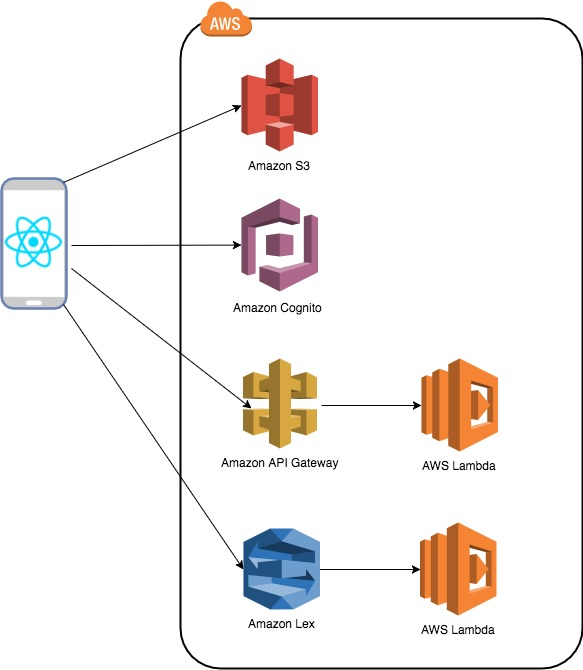

# Building a Mobile "ChatBot" application in React Native with AWS

The objective is to start to get familiar with AWS Mobile services, including AWS Amplify and building a simple chatbot mobile application.

### Overall target architecture of the workshop

  

### [1. Prerequisites](./Prerequisites/)

To setup the environment with all the requirements.
  
### [2. Create a React Native application](./createApp/)

Creation of a basic React Native application

### [3. Lesson 1 - Introduction to AWS Mobile Hub and AWS Amplify](./lesson1/)

Introduction to AWS Mobile Hub and AWS Amplify to help developing your cloud enabled mobile applications.

### [4. Lesson 2 - Adding Authentication using AWS Amplify Authentication Component](./lesson2/)

Bringing authentication mechanism to your application.

### [5. Lesson 3 - Adding Cloud Storage capabilities using AWS Amplify Storage Component - Optional](./lesson3)

Bringing storage capabilities to your application.

### [6. Lesson 4 - Adding API Calls capabilities using AWS Amplify API Component - Optional](./lesson4/)

Adding interactions to your backend through APIs.

### [7. Lesson 5 - Adding Chatbot Interactions capabilities using AWS Amplify](./lesson5)

Adding interactions with chatbot.

### 8. Clean up your environment

Delete all the resources created in your AWS environment

- Amazon Lex Chatbot and AWS Lambda created for the chatbot
- All resources created with Amplify `amplify delete` when located in your application directory
- Any Lambda functions created aside of amplify
