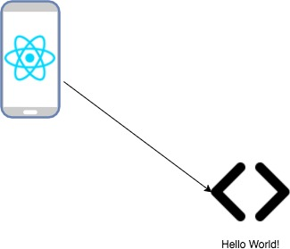

# Create a React Native Application

## 1. Architecture that will be achieved

<p align="center">
  
</p>

## 2. Steps to create a simple React Native application

- Using create-react-native-app
` create-react-native-app <appName> `
- cd into your new app dir.
` cd <appName> `
- You can either "eject" the application to set up your own custom builds or run it using Expo. 
- To "eject" your react native app (in our examples call it "myapp")
` npm run eject `

```
? How would you like to eject from create-react-native-app? React Native: I'd like a regular React Native project.

We have a couple of questions to ask you about how you'd like to name your app:
? What should your app appear as on a user's home screen? 
? What should your Android Studio and Xcode projects be called? 
```
  
