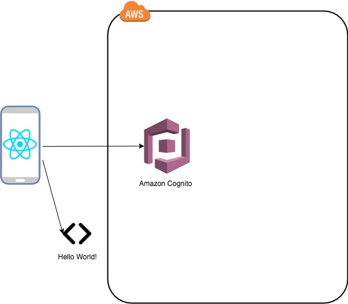

# Lesson 2 - Adding Authentication using AWS Amplify Authentication Component

## 1. Architecture that will be achieved

<p align="center">
    
</p>

## 2. Steps to add Authentication

1. Add the authentication component to your AWS environment, Cognito, using AWS Amplify

- Add Cognito in your backend using Amplify CLI
` amplify auth add`
- Then push the configuration to build the resources and build it in AWS
` amplify push`

2. Using Authenticator Component

For React and React Native apps, the simplest way to add authentication flows into your app is to use withAuthenticator High Order Component. 

withAuthenticator automatically detects the authentication state and updates the UI. If the user is signed in, the underlying component (typically your app’s main component) is displayed otherwise signing/signup controls is displayed.

- Configure your application
```
import { withAuthenticator } from 'aws-amplify-react-native';
...
export default withAuthenticator(App); # export default withAuthenticator(class App extends React.Component {
```
The withAuthenticator component adds Sign Up, Sign In with MFA and Sign Out capabilites to your app out of box.
Now, your app has complete flows for user sign-in and registration. Since you have wrapped your App with withAuthenticator, only signed in users can access your app. The routing for login pages and giving access to your App Component will be managed automatically.

3. Use your own Components + Amplify API calls

You can build your own UI Components and the API calls using Amplify. You would need to include:

- `import { Auth } from 'aws-amplify';`
Using the AWS Amplify Auth API Calls:

- SignIn
```
import { Auth } from 'aws-amplify';

Auth.signIn(username, password)
    .then(user => console.log(user))
    .catch(err => console.log(err));

// If MFA is enabled, sign-in should be confirmed with the congirmation code
// `user` : Return object from Auth.signIn()
// `code` : Confirmation code  
// `mfaType` : MFA Type e.g. SMS, TOTP.
Auth.confirmSignIn(user, code, mfaType)
    .then(data => console.log(data))
    .catch(err => console.log(err));
```

- SignUp
```
import { Auth } from 'aws-amplify';

Auth.signUp({
    username,
    password,
    attributes: {
        email,          // optional
        phone_number,   // optional - E.164 number convention
        // other custom attributes 
    },
    validationData: []  //optional
    })
    .then(data => console.log(data))
    .catch(err => console.log(err));

// After retrieveing the confirmation code from the user
Auth.confirmSignUp(username, code, {
    // Optional. Force user confirmation irrespective of existing alias. By default set to True.
    forceAliasCreation: true    
}).then(data => console.log(data))
  .catch(err => console.log(err));
  ```
- For complete list of API calls, refer to [Reac Native Documentation}(https://aws-amplify.github.io/amplify-js/media/authentication_guide)
