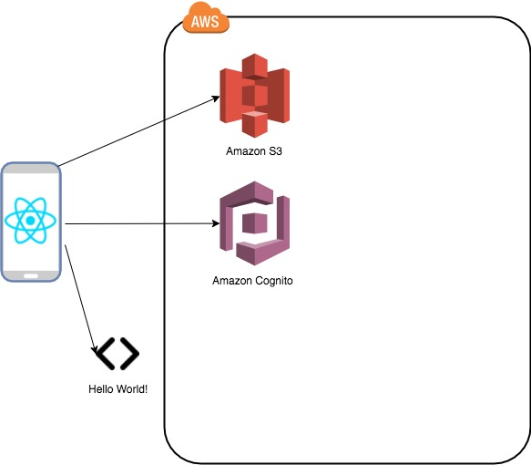

# Lesson 3 - Adding Cloud Storage capabilities using AWS Amplify Storage Component - Optional

## 1. Architecture that will be achieved

<p align="center">
        
</p>

## 2. Steps to add Storage

1. Add the storage component to your AWS environment

        a. Using AWS Amplify

You can either implement a storage for content (Images, audio, video...) or a NoSQL database.

` amplify storage add`

Select the appropriate options.

- Then push the configuration to build the resources and build it in AWS
` amplify push`

        b. Using AWS Mobile Hub

- Create the storage resources
```
awsmobile user-files enable
```
>> Output
```
enabled: user-files
backend awsmobile project enabled features:
analytics, hosting, user-files, user-signin
```
- Push the configuration
```
awsmobile push
```

2. Using the Amplify React Native Photo Picker Component

- Configure your application
``` 
Storage.put('yourFile.txt', 'your key', {
        level: 'private', //access control level
        contentType: 'text/plain' 
    })
    .then (result => console.log(result))
    .catch(err => console.log(err));
```

AWS Amplify Storage components provides API calls to:
- PUT
- GET
- REMOVE
- LIST

To learn more on the AWS Amplfy Storage components please refer to [AWS Amplify Storage Component](https://aws-amplify.github.io/amplify-js/media/storage_guide.html)
