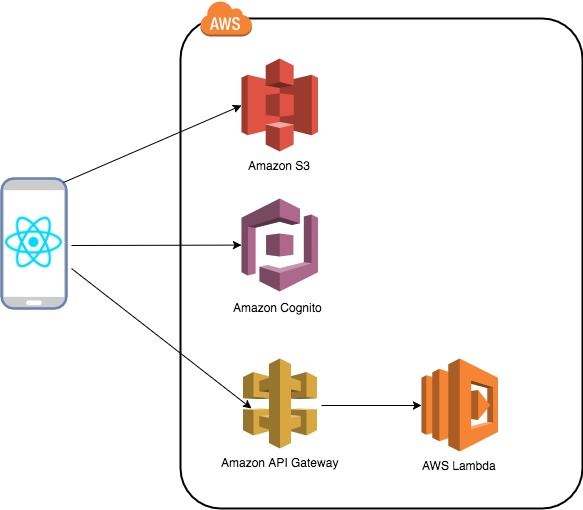

# Lesson 4 - Adding API Calls capabilities using AWS Amplify API Component - Optional

## 1. Architecture that will be achieved

<p align="center">
      
</p>

## 2. Steps to add API capabilities

AWS Amplify provides a solution to making HTTP REST and GraphQL endpoints. The following example will cover REST APIs.
To learn more on the AWS Amplify API components, please refer to [AWS Amplify API](https://aws-amplify.github.io/amplify-js/media/api_guide)

The REST API Calls covered by Ampify are:
- GET
- PUT
- POST
- DELETE
- HEAD

1. Add an API component to your AWS environment.

```
amplify api add

? Please select from one of the below mentioned services REST
? Provide a friendly name for your resource to be used as a label for this category in the project: xxxx
? Provide a path (e.g., /items) /items
? Choose a Lambda source Create a new Lambda function
? Provide a friendly name for your resource to be used as a label for this category in the project: xxxx
? Provide the AWS Lambda function name: xxxx
? Choose the function template that you want to use: Serverless express function (Integration with Amazon API Gateway)
? Do you want to edit the local lambda function now? true
Please edit the file in your editor: xxxx
? Press enter to continue
? Press enter to continue
Succesfully added the Lambda function locally
? Restrict API access (Y/n) n
? Restrict API access No
? Do you want to add another path? (y/N)
? Do you want to add another path? No
Successfully added resource xxx locally
```
2. Updating your Lambda Function
3. Push the change to your AWS environment

```
amplify push
```

Amplify will create the required services to expose a REST API using:
- Amazon API Gateway with the required configuration
- AWS Lambda functions

4. Check on the AWS console the services created
- Amazon API Gateway

- AWS Lambda

5. Updating your application

```
import Amplify, {API} from 'aws-amplify'
import aws_export from './src/aws-exports'

Amplify.configure(aws_export)
```

To invoke a REST API, you need the name for the related endpoint. If you manually configure the API, you already have a name for the endpoint. If you use Automated Setup, you can find the API name in your local configuration file.

To invoke an endpoint, you need to set apiName, path and headers parameters, and each method returns a Promise.

Under the hood the API category utilizes Axios to execute the HTTP requests. API status code response > 299 are thrown as an exception. If you need to handle errors managed by your API, work with the error.response object.

```
let apiName = 'xxx'; //The name can be found in ./src/aws-exports.js
let path = '/items'; //The path of your API

API.get(apiName,path).then(response => {
      console.log('Success: ', response)
    })
    .catch(error => {
      console.log('Error: ', error.response)
    })
```

6. Example using a Button

```
export default class App extends React.Component {

  getLabel = () => {
    API.get(apiName,path).then(response => {
      console.log('Success: ', response)
    })
    .catch(error => {
      console.log('Error: ', error.response)
    })
  }
  render() {
    
    return (
      <View style={styles.container}>
        <Text>Open up App.js to start working on your app!</Text>
        <Button title="Press" onPress={this.getLabel} />
      </View>
      
    );
  }
}
```

7. Test

When reloading the application on your device or on the emulator, you will be able to see the button and when pressed, the console should display the GET API call feedback.

```
[11:47:56] Success:  Object {
[11:47:56]   "success": "get call succeed!",
[11:47:56]   "url": "/items",
[11:47:56] }
```
